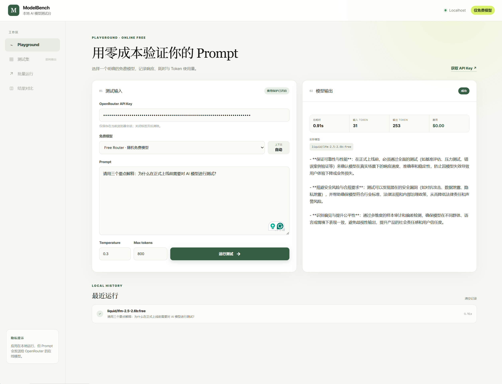

# ModelBench Local

一个在本地运行、只允许调用 OpenRouter 免费模型的 AI Prompt 测试台。

## 本地启动

1. 安装 Node.js 22.13 或更高版本，以及 pnpm。
2. 在本目录执行 `pnpm install`。
3. 执行 `pnpm dev`。
4. 打开终端显示的 localhost 地址。
5. 在页面中临时填写 OpenRouter API Key。

API Key 只保存在浏览器 `sessionStorage`，不会写入项目文件或历史记录。服务端会在每次请求前验证模型当前仍为零价格；付费模型会被拒绝。
